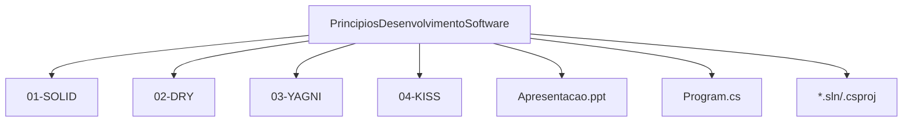

# 📘 Princípios de Desenvolvimento de Software

> Um projeto demonstrativo dos principais **princípios de design orientado a objetos** e boas práticas de desenvolvimento de software (SOLID, DRY, KISS, YAGNI).


---

## 📖 Visão Geral

Este repositório tem como objetivo:

* Demonstrar os **princípios SOLID** (Single Responsibility, Open/Closed, Liskov, Interface Segregation, Dependency Inversion)
* Apresentar os princípios gerais: **DRY** (Don’t Repeat Yourself), **KISS** (Keep It Simple, Stupid) e **YAGNI** (You Ain’t Gonna Need It)
* Fornecer exemplos em código, comparativos e arquivos de apoio para estudo e aplicação prática

É ideal para desenvolvedores que querem:

* Reforçar a base de design de software orientado a objetos
* Aplicar boas práticas em projetos reais
* Usar como referência didática para treinamentos ou revisões de código

---

## 🧩 Estrutura do Projeto



**Descrição das pastas:**

* `01‑SOLID` → Exemplos dos princípios SOLID
* `02‑DRY` → Casos e anti‑casos de repetição de código
* `03‑YAGNI` → Exemplos de sobre‑engenharia e quando evitar
* `04‑KISS` → Código simples vs. código complexo
* Arquivos como `Apresentacao.ppt` → Material de apoio para slides e workshops

---

## 🧪 Tecnologias Utilizadas

* **.NET 8** — Plataforma moderna para desenvolvimento em C#
* **C#** — Linguagem de programação orientada a objetos
* Projeto de console/API com exemplos simples focados em design

---

## ⚙️ Pré‑requisitos

Antes de executar o projeto localmente, garanta que você tem:

* ✅ [Visual Studio 2022](https://visualstudio.microsoft.com/) ou [VS Code](https://code.visualstudio.com/)
* ✅ [.NET 8 SDK](https://dotnet.microsoft.com/download/dotnet/8.0)
* ✅ Familiaridade básica com C# e OOP

---

## 🚀 Como Executar Localmente

1. Clone este repositório:

   ```bash
   git clone https://github.com/thiagodsantana/PrincipiosDesenvolvimentoSoftware.git
   cd PrincipiosDesenvolvimentoSoftware
   ```
2. Abra a solução (`.sln`) ou projeto em sua IDE preferida.
3. Compile e execute. Explore os exemplos nas pastas para ver como os princípios são aplicados.
4. Consulte o arquivo de apresentação para um panorama conceitual‑teórico.

---

## 💡 Objetivo Educacional

Este projeto serve para:

* Estudo de boas práticas de design orientado a objetos
* Workshop ou treinamento interno de times de desenvolvimento
* Revisão e capacitação técnica com base em exemplos práticos

---

## 📚 Boas Práticas e Recomendações

* Reforce os **princípios SOLID** em novos ou existentes projetos
* Evite **duplicação de código** (DRY) sempre que possível
* Mantenha **simplicidade** (KISS) em vez de complexidade desnecessária
* Evite **implementar funcionalidades antecipadamente** (YAGNI) — só desenvolva o que for realmente necessário
* Documente e comente os exemplos para facilitar aprendizado e revisão

---

## 🤝 Contribuindo

1. Faça um fork deste repositório.
2. Crie uma branch:

   ```bash
   git checkout ‑b feature/novo‑exemplo
   ```
3. Adicione exemplos, materiais de apoio ou melhorias.
4. Faça commit:

   ```bash
   git commit ‑m "Adiciona exemplo de princípio X"
   ```
5. Envie para o seu fork:

   ```bash
   git push origin feature/novo‑exemplo
   ```
6. Abra um Pull Request para revisão e integração.

---

## 🪪 Licença

Este projeto está sob a **Licença MIT** — livre para uso, estudo e modificação.

---

## ✉️ Contato

**Autor:** [Thiago D. Santana](https://github.com/thiagodsantana)
**LinkedIn:** [linkedin.com/in/thiagodsantana](https://linkedin.com/in/thiagodsantana)
**E‑mail:** [thiago.darley@gmail.com](mailto:thiago.darley@gmail.com)
